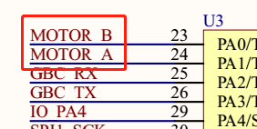
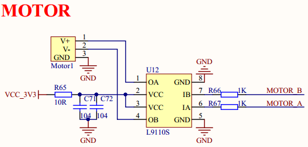
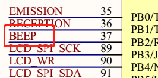
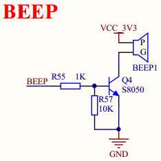
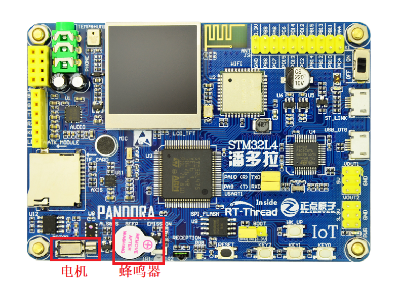

# 蜂鸣器和电机控制例程

## 简介

本例程主要功能为使用按键控制蜂鸣器和电机，当按下 KEY0 后电机左转，当按下 KEY1 后电机右转，当按下 KEY2 后电机停止，当按住 WK_UP 时蜂鸣器鸣叫，松开 WK_UP 后蜂鸣器关闭。其中 KEY0 KEY1 KEY2 三个按键会触发中断，通过 pin 设备的中断回调函数控制电机， WK_UP 按键通过轮询的方式控制蜂鸣器鸣叫。

## 硬件说明





如上图所示，`MOTOR_A` PA1（24），`MOTOR_B` PA0（23） 分别连接电机驱动芯片L9110S的控制引脚，控制逻辑如下表格所示。

|IA|IB|OA|OB|电机动作|
|--|--|--|--|--|
|H|L|H|L|右转|
|L|H|L|H|左转|
|L|L|L(刹车)|L（刹车）|停止|
|H|H|Z（高阻）|Z（高阻）|停止|





如上图所示，`BEEP` PB0（35）引脚控制板载蜂鸣器。

电机与蜂鸣器在开发板中的位置如下图所示：




## 软件说明

按键控制蜂鸣器和电机的源代码位于 `/examples/04_basic_beep_motor/applications/main.c` 中。

1. 查对应原理图可知， KEY0 、 KEY1 、KEY2 按下为低电平，松开为高电平， WK_UP 按下为高电平，松开为低电平。所以在 main 函数中，首先将 KEY0 、 KEY1 、KEY2 三个按键引脚配置为上拉输入模式，WK_UP 按键设置为下拉输入模式，将`PIN_MOTOR_A` `PIN_MOTOR_B` `PIN_BEEP` 引脚设置为输出模式。
2. 然后使用 `rt_pin_attach_irq` 函数分别设置 KEY0 、 KEY1 、KEY2 按键中断为下降沿触发中断并且绑定回调函数、设置回调函数相应的入参,使用 `rt_pin_irq_enable` 函数使能这三个按键中断。
3. 最后在 while 循环里轮询 WK_UP 的按键状态，当成功判断 WK_UP 按键按下时调用 `beep_ctrl(1)` 蜂鸣器鸣叫，否则调用 `beep_ctrl(0)` 蜂鸣器关闭。


```c
int main(void)
{
    unsigned int count = 1;

    /* 设置 KEY 引脚的模式为输入模式 */
    rt_pin_mode(PIN_KEY0, PIN_MODE_INPUT_PULLUP);
    rt_pin_mode(PIN_KEY1, PIN_MODE_INPUT_PULLUP);
    rt_pin_mode(PIN_KEY2, PIN_MODE_INPUT_PULLUP);
    rt_pin_mode(PIN_WK_UP, PIN_MODE_INPUT_PULLDOWN);

    /* 设置电机控制引脚为输入模式 */
    rt_pin_mode(PIN_MOTOR_A, PIN_MODE_OUTPUT);
    rt_pin_mode(PIN_MOTOR_B, PIN_MODE_OUTPUT);

    /* 设置蜂鸣器引脚为输出模式 */
    rt_pin_mode(PIN_BEEP, PIN_MODE_OUTPUT);

    /* 设置 KEY 引脚中断模式以及设置中断的回调函数 */
    rt_pin_attach_irq(PIN_KEY0, PIN_IRQ_MODE_FALLING, irq_callback, (void *)PIN_KEY0);
    rt_pin_attach_irq(PIN_KEY1, PIN_IRQ_MODE_FALLING, irq_callback, (void *)PIN_KEY1);
    rt_pin_attach_irq(PIN_KEY2, PIN_IRQ_MODE_FALLING, irq_callback, (void *)PIN_KEY2);

    /* 使能中断 */
    rt_pin_irq_enable(PIN_KEY0, PIN_IRQ_ENABLE);
    rt_pin_irq_enable(PIN_KEY1, PIN_IRQ_ENABLE);
    rt_pin_irq_enable(PIN_KEY2, PIN_IRQ_ENABLE);

    while (count > 0)
    {
        if (rt_pin_read(PIN_WK_UP) == PIN_HIGH)
        {
            rt_thread_mdelay(50);
            if (rt_pin_read(PIN_WK_UP) == PIN_HIGH)
            {
                rt_kprintf("WK_UP pressed. beep on.\n");
                beep_ctrl(1);
            }
        }
        else
        {
            beep_ctrl(0);
        }
        rt_thread_mdelay(10);
        count++;
    }
    return 0;
}
```

在中断回调函数中判断入参，根据不同入参进行相应的操作。

```c
/* 中断回调函数 */
void irq_callback(void *args)
{
    rt_uint32_t sign = (rt_uint32_t)args;
    switch (sign)
    {
    case PIN_KEY0:
        motor_ctrl(MOTOR_LEFT);
        rt_kprintf("KEY0 interrupt. motor turn left.\n");
        break;
    case PIN_KEY1:
        motor_ctrl(MOTOR_RIGHT);
        rt_kprintf("KEY1 interrupt. motor turn right.\n");
        break;
    case PIN_KEY2:
        motor_ctrl(MOTOR_STOP);
        rt_kprintf("KEY2 interrupt. motor stop.\n");
        break;
    default:
        rt_kprintf("error sign= %d !\n", sign);
        break;
    }
}
```

## 运行

### 编译&下载

- **MDK**：双击 `project.uvprojx` 打开 MDK5 工程，执行编译。
- **IAR**：双击 `project.eww` 打开 IAR 工程，执行编译。

编译完成后，将开发板的 ST-Link USB 口与 PC 机连接，然后将固件下载至开发板。

### 运行效果

按下复位按键重启开发板，按下 KEY0 后电机左转，按下 KEY1 后电机右转，按下 KEY2 后电机停止，最后按住 WK_UP 后蜂鸣器鸣叫，松开 WK_UP 后蜂鸣器关闭。

|按键|功能|
|----|---|
|KEY0|电机左转|
|KEY1|电机右转|
|KEY2|电机停止|
|WK_UP|蜂鸣器鸣叫|

此时也可以在 PC 端使用终端工具打开开发板的 ST-Link 提供的虚拟串口，设置 115200 8 1 N 。开发板的运行日志信息即可实时输出出来。

```shell
KEY0 interrupt. motor turn left.
KEY0 interrupt. motor turn left.
KEY1 interrupt. motor turn right.
KEY1 interrupt. motor turn right.
KEY2 interrupt. motor stop.
KEY2 interrupt. motor stop.
KEY2 interrupt. motor stop.
WK_UP pressed. beep on.
```

## 注意事项

暂无。

## 引用参考

- 《通用GPIO设备应用笔记》: docs/AN0002-RT-Thread-通用 GPIO 设备应用笔记.pdf
- 《RT-Thread 编程指南》: docs/RT-Thread 编程指南.pdf