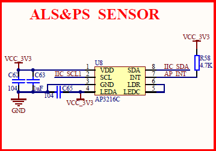
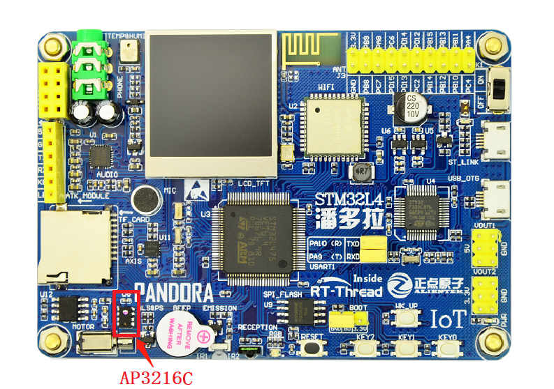

# AP3216C 接近与光强传感器例程 

## 简介

本例程主要功能是利用 RT-Thread 的AP3216C 软件包读取传感器 `ap3216c` 测量的接近感应（ps，proximity sensor）与光照强度（als，ambient light sensor）。

## AP3216C 软件包简介

AP3216C 软件包提供了使用接近感应（ps）与光照强度（als）传感器 `ap3216c` 基本功能，并且提供了硬件中断的可选功能，如需详细了解该软件包，请参考 AP3216C 软件包中的 [README](https://github.com/RT-Thread-packages/ap3216c/blob/master/README.md)。

## 硬件说明

`ap3216c` 硬件原理图如下所示：




如上图所示，单片机通过 IIC_SDA(PC1)、IIC_SCL1(PC0) 对传感器 `ap3216c` 发送命令、读取数据等，AP_INT(PC13) 为硬件中断引脚。

接近感应与光照强度传感器在开发板中的位置如下图所示：



该传感器能够实现如下功能：

- **光照强度** ：支持 4 个量程
- **接近感应** ：支持 4 种增益
- **中断触发** ：光照强度及接近感应同时支持 `高于阈值` 或 `低于阈值` 的两种硬件中断触发方式

## 软件说明

接近感应与光照强度传感器 `ap3216c` 的示例代码位于 `/examples/08_driver_als_ps/applications/main.c` 中，主要流程：初始化传感器 `ap3216c`，传入参数 `i2c1` 为该传感器挂载的 `i2c` 总线的名称；初始化若失败，则返回空，程序不会被执行，若成功，则返回传感器设备对象；然后将返回设备对象分别传入获取 `als` 与 `ps` 函数，获取测量的 `als` 与 `ps` 值（详细的 API 介绍参考 [`ap3216c `软件包](https://github.com/RT-Thread-packages/ap3216c)读取接近感应与光照强度章节，源码参考 [ap3216c.c](https://github.com/RT-Thread-packages/ap3216c/blob/master/ap3216c.c) ）。示例代码如下：


```c
int main(void)
{
    ap3216c_device_t dev;              /* device object */
    const char *i2c_bus_name = "i2c1"; /* i2c bus */
    int count = 0;                     /* read count */

    rt_thread_mdelay(2000);/* waiting for sensor work */
        
    /* initializes ap3216c, registered device driver */
    dev = ap3216c_init(i2c_bus_name);
    if(dev == RT_NULL)
    {
        rt_kprintf(" The sensor initializes failure");
        return 0;
    }
    /* continous reading 100 times */
    while (count++ < 100)
    {
        rt_uint16_t ps_data;
        float brightness;

        /* read ps data */
        ps_data = ap3216c_read_ps_data(dev);
        if (ps_data == 0)
        {
            rt_kprintf("object is not proximity of sensor \n");
        }
        else
        {
            rt_kprintf("current ps data   : %d\n", ps_data);
        }

        /* read als data */
        brightness = ap3216c_read_ambient_light(dev);
        rt_kprintf("current brightness: %d.%d(lux) \n", (int)brightness, ((int)(10 * brightness) % 10));

        rt_thread_mdelay(1000);
    }
    return 0;
}
```

### 编译&下载

- **MDK**：双击 `project.uvprojx` 打开 MDK5 工程，执行编译。
- **IAR**：双击 `project.eww` 打开 IAR 工程，执行编译。

编译完成后，将开发板的 ST-Link USB 口与 PC 机连接，然后将固件下载至开发板。

### 运行效果

烧录完成后，此时可以在 PC 端使用终端工具打开开发板的 ST-Link 提供的虚拟串口，设置串口波特率为 115200，数据位 8 位，停止位 1 位，无流控，开发板的运行日志信息即可实时输出出来，显示如下所示：

```shell
 \ | /
- RT -     Thread Operating System
 / | \     3.1.0 build Aug 27 2018
 2006 - 2018 Copyright by rt-thread team
msh >current ps data      : 69
current brightness: 25.5(lux) 
current ps data   : 69
current brightness: 25.5(lux) 
current ps data   : 69
current brightness: 25.5(lux) 
current ps data   : 69
current brightness: 25.5(lux) 
current ps data   : 61
current brightness: 25.5(lux) 
current ps data   : 61
current brightness: 25.5(lux) 
current ps data   : 61
current brightness: 25.5(lux) 
```

## 注意事项

暂无。

## 引用参考

- 《RT-Thread 编程指南》: docs/RT-Thread 编程指南.pdf
- 《I2C 设备应用笔记》: docs/AN0003-RT-Thread-I2C 设备应用笔记
- 《ap3216c 软件包介绍》：[https://github.com/RT-Thread-packages/ap3216c](https://github.com/RT-Thread-packages/ap3216c)
