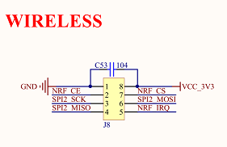
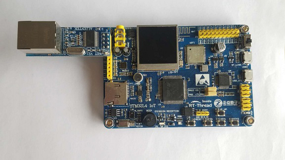

# ENC28J60 以太网模块例程

## 简介

本例程的主要功能是让 IOT BOARD 通过 ENC28J60 连接互联网。

## 硬件说明

ENC28J60 是带 SPI 接口的独立以太网控制器，兼容 IEEE 802.3，集成 MAC 和 10 BASE-T PHY，最高速度可达 10Mb/s。

ENC28J60 是通过板子上的 WIRELESS 插座连接单片机的，利用 SPI2 和单片机进行通讯。原理图和实物图如下所示：





## 软件说明

ENC28J60 初始化的源代码位于 `/drivers/drv_enc28j60.c` 中。

因为 ENC28J60 是通过 SPI 和单片机进行通讯的，所以需要通过 enc28j60_attach() 函数将 ENC28J60 连接到 SPI 设备上，IOT Board 提供了专门的接口，对应 SPI21 设备。这样，就能利用 RT-Thread 的 SPI 框架和 ENC28J60 进行通讯了。

然后就是将 ENC28J60 的中断处理函数通过 rt_pin_attach_irq() 函数绑定到对应的管脚上去，这里用到的是85号管脚（PD4）。

最后利用 RT-Thread 的 INIT_COMPONENT_EXPORT 宏定义，将 enc28j60_init() 函数加入开机自动初始化。这样，板子上电后，就会自动执行 ENC28J60 的初始化函数，无需用户手动调用。

```c
#include <drivers/pin.h>
#include <enc28j60.h>

#define ENC28J60_IRQ_PIN 85

int enc28j60_init(void)
{
    /* 连接 ENC28J60 和 SPI设备. spi21 cs - PD6 */
    enc28j60_attach("spi21");

    /* 初始化中断管脚 */
    rt_pin_mode(ENC28J60_IRQ_PIN, PIN_MODE_INPUT_PULLUP);
    rt_pin_attach_irq(ENC28J60_IRQ_PIN, PIN_IRQ_MODE_FALLING, enc28j60_isr, RT_NULL);
    rt_pin_irq_enable(ENC28J60_IRQ_PIN, PIN_IRQ_ENABLE);
    
    return 0;
}
INIT_COMPONENT_EXPORT(enc28j60_init);
```

`/examples/18_iot_spi_eth_enc28j60/applications/main.c`实现了 5S 定时 ping www.rt-thread.org，成功则退出的功能。

代码如下所示：

```c
#include <rtthread.h>

int main(void)
{
    extern rt_err_t ping(char* target_name, rt_uint32_t times, rt_size_t size);
    
    /* 等待网络连接成功 */
    rt_thread_mdelay(500);
    
    while(1)
    {
        if(ping("www.rt-thread.org", 4, 0) != RT_EOK)
        {
            rt_thread_mdelay(5000);
        }
        else
        {
            break;
        }
    }
    
    return 0;
}
```

## 运行

### 编译&下载

- **MDK**：双击 `project.uvprojx` 打开 MDK5 工程，执行编译。
- **IAR**：双击 `project.eww` 打开 IAR 工程，执行编译。

编译完成后，将开发板的 ST-Link USB 口与 PC 机连接，然后将固件下载至开发板。

### 运行效果

按下复位按键重启开发板，可以看到板子会打印出如下信息：

```shell
 \ | /
- RT -     Thread Operating System
 / | \     3.1.0 build Aug 28 2018
 2006 - 2018 Copyright by rt-thread team
lwIP-2.0.2 initialized!
msh />60 bytes from 118.31.15.152 icmp_seq=0 ttl=52 time=8 ticks
60 bytes from 118.31.15.152 icmp_seq=1 ttl=52 time=9 ticks
60 bytes from 118.31.15.152 icmp_seq=2 ttl=52 time=9 ticks
60 bytes from 118.31.15.152 icmp_seq=3 ttl=52 time=9 ticks
```

能显示响应时间（time=xx ticks）的就表示网络已经准备初始化成功，可以和外网进行通讯了。

联网成功后，开发者可以通过 BSD Socket API 进行网络开发了，也可以通过 ENV 选择 RT-Thread 提供的网络软件包来加速应用开发。

## 注意事项

`drv_enc28j60.c` 里面并没有真正的初始化代码，只是调用了 RT_Thread 提供的 `enc28j60.c` 文件里的函数来初始化的，想了解 ENC28J60 初始化和中断函数详情的，可以查看 `/rt-thread/components/drivers/spi/enc28j60.c` 文件来学习。

## 引用参考

- 《GPIO 设备应用笔记》: docs/AN0002-RT-Thread-通用 GPIO 设备应用笔记.pdf
- 《SPI 设备应用笔记 》: docs/AN0004-RT-Thread-SPI 设备应用笔记.pdf
- 《RT-Thread 编程指南 》: docs/RT-Thread 编程指南.pdf